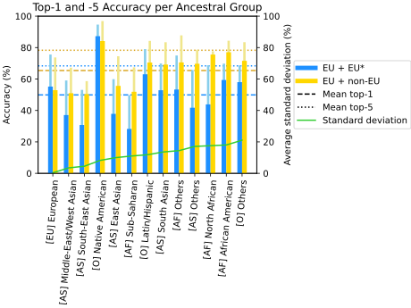
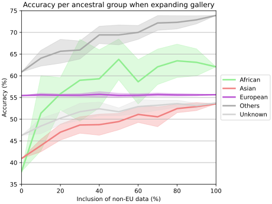

# GestaltMatcher-Arc
This repository contains all the code used to train and evaluate our GestaltMatcher-Arc models in our Nature Genetics 
submission paper: GestaltMatcher Database - A global reference for facial phenotypic variability in rare human diseases 
(link follows soon).
This repo also contains snippets of code from insightface (https://github.com/deepinsight/insightface); both from their 
alignment process and their RetinaFace detector.

In order to reproduce the results, access must be requested to the GestaltMatcher DataBase (GMDB) v1.1.0. That can be 
done following this link (https://db.gestaltmatcher.org/documents) if you're affiliated with a medical facility or 
faculty.

First, we provide a step-by-step process of preparing the data, training the models, and evaluating the overall 
performance. 
If you're only interested in reproducing the results achieved in the paper, and already have the image encodings, 
simply run the code snippets provided in the "Evaluation and Reproduction"-section at the bottom of this document.

## Step-by-step setup
### Environment
Please use python version 3.8 or (3.7+), and the package listed in requirements.txt.

<strong>The following setup is verified in the following environments:</strong>

* Window 11
* RTX4090
* cuda 11.8
* pytorch 2.3.1</strong></p>

```
python3 -m venv env_gm
source env_gm/Scripts/activate
pip install -r requirements.txt
```

If you would like to train and evaluate with GPU, please remember to install cuda in your system.
If you don't have GPU, please choose the CPU option (`--no_cuda`) in the following section.

Follow these instructions (https://developer.nvidia.com/cuda-downloads) to properly install CUDA.

Follow the necessary instructions (https://pytorch.org/get-started/locally/) to properly install PyTorch, you might still need additional dependencies (e.g. Numpy).
Using the following command should work for most using the `conda` virtual env.
```conda install pytorch torchvision torchaudio pytorch-cuda=11.8 -c pytorch -c nvidia```

If any problems occur when installing the packages in `requirements.txt`, the most important packages are:
```
numpy==1.24.4
pandas==2.0.3
torch==2.3.1
torchaudio==2.3.1
torchvision==0.18.1
tensorboard==2.14.0
opencv-python-headless==4.10.0.84
matplotlib==3.7.5
scikit-image==0.21.0
scikit-learn==1.3.2
onnx==1.16.1
onnx2torch==1.4.1
albumentations==1.2.1
pillow==10.4.0
```

### Pretrained models
Due to ethical reasons the pretrained models are not made available publicly. \
Once access has been granted to GMDB, the pretrained model weights can be requested as well.

Save the following files in ./saved_models/
1. Resnet50_Final.pth (for the data preparation - face alignment)
2. glint360k_r50.onnx (base pre-trained model for model a)
3. glint360k_r100.onnx (base pre-trained model for model b)

Trained models by our group:
1. s1_glint360k_r50_512d_gmdb__v1.1.0_bs64_size112_channels3_last_model.pth (model 1 for the encoding)
2. s2_glint360k_r100_512d_gmdb__v1.1.0_bs128_size112_channels3_last_model.pth (model 2 for the encoding)

### Crop and align faces
Note: nowadays the shared data also contains pre-cropped and -aligned images by default with the dataset, so this step
is optional. The directory `./gmdb_crops` contains these cropped and aligned images.

In order to manually crop and aligned images, you have to run `crop_align.py`. It is possible to either crop and align 
a single image, multiple images in a list or a directory of images.\
With `python crop_align.py` you will crop and align all images in `--data` (default: `./data/cases`) and save them to 
the `--save_dir` (default: `./data/cases_align`). This is quite free-form and does not need to be a directory, but can 
also be an image name or list of image names.

The face cropper requires the model-weights "Resnet50_Final.pth". Remember to download them from 
[Google Docs](https://drive.google.com/open?id=1oZRSG0ZegbVkVwUd8wUIQx8W7yfZ_ki1) with pw: fstq \
If you don't have GPU, please use `--no_cuda` to run on cpu mode.

```
# crop and align the original v1.1.0 
python .\crop_align.py --data ..\data\GestaltMatcherDB\v1.1.0\gmdb_images --save_dir ..\data\GestaltMatcherDB\v1.1.0\gmdb_align
```

### Train models
For the base models, the training of GestaltMatcher-Arc needs to be run twice:
* a) for the resnet-50 mix model, and
* b) for the resnet-100 model.
For these also require the pretrained ArcFace models from insightface: `glint360k_r50.onnx` and `glint360k_r100.onnx` to 
be in the directory `./saved_models`. \
These models can be downloaded here: https://github.com/deepinsight/insightface/tree/master/model_zoo 

The pretrained models by default are stored in a directory set by `--weight_dir` (default:`./saved_models/`). Further, 
using the arguments `--model_a_path`, `--model_b_path` and `--model_c_path`, the paths within this directory need to be
specified (default: uses all supplied model names). \
When setting any of those to 'None' they will not be included in the ensemble.

To reproduce our Gestalt Matcher model listed in the table by training from scratch, use:
```
python train_gm_arc.py --paper_model a --epochs 50 --session 1 --dataset gmdb --in_channels 3 --img_size 112 --use_tensorboard --local --data_dir ../data --dataset_version v1.1.0 
python train_gm_arc.py --paper_model b --epochs 50 --session 2 --dataset gmdb --in_channels 3 --img_size 112 --use_tensorboard --local --data_dir ../data --dataset_version v1.1.0 
```

You may choose whatever seed and session you find useful.
`--seed 11` was used to obtain these results, others have not been tested.

Using the argument `--use_tensorboard` allows you to track your models training and validation curves over time.

Training a model without GPU has not been tested.

### Encode photos
With `python predict_ensemble.py` you will encode all images in `--data_dir` (default: 
`'../data/GestaltMatcherDB/v1.1.0/gmdb_crops'`) into image representations. The resulting image representation are 
stored in a file called `all_encodings.csv`.
You will also need to provide the location of the model weights with `--weight_dir`.

For machines without a GPU, please use `--no_cuda`.
```
# encode the whole GMDB dataset to obtain the gallery encodings
python predict.py 
  --weight_dir saved_models 
  --data_dir ../data/GestaltMatcherDB/v1.1.0/gmdb_crops/
```

There are 12 encodings per image because there are three models, and test-time augmentation including flip and
color/grey. Please find more detail in our paper [Hustinx et al., WACV 2023](https://openaccess.thecvf.com/content/WACV2023/papers/Hustinx_Improving_Deep_Facial_Phenotyping_for_Ultra-Rare_Disorder_Verification_Using_Model_WACV_2023_paper.pdf). 

The structure of the file is shown below.

| Field                       | Value                                                                    |
| -------------------- |--------------------------------------------------------------------------|
| `img_name`          | `cdls_demo_aligned.jpg`                                                  |
| `model`             | `m0, m1, or m2`                                                          |
| `flip`              | `0 or 1`                                                                 |
| `gray`              | `0 or 1`                                                                 |
| `class_conf`        | `[19.153106689453125, -1.1602606773376465, ...]` (truncated for brevity) |
| `representations` | `[1.054652452468872, 0.4113105237483978, ...]` (truncated for brevity)   |
Note: m2 (the base ArcFace model) does not have any class confidences of interest, thus we leave it empty (`[0]`).

### Evaluate on the whole dataset
The following result is evaluating the whole v1.1.0 GMDB dataset.
```
python .\evaluate_ensemble.py

===========================================================
---------   test: Frequent, gallery: Frequent    ----------
|Test set     |Gallery |Test  |Top-1 |Top-5 |Top-10|Top-30|
|GMDB-frequent|8794    |882   |42.37 |65.48 |71.07 |83.68 |
---------       test: Rare, gallery: Rare        ----------
|Test set     |Gallery |Test  |Top-1 |Top-5 |Top-10|Top-30|
|GMDB-rare    |922.6   |386.4 |32.61 |47.22 |54.61 |68.57 |
--------- test: Frequent, gallery: Frequent+Rare ----------
|Test set     |Gallery |Test  |Top-1 |Top-5 |Top-10|Top-30|
|GMDB-frequent|9716.6  |882   |42.10 |63.79 |70.49 |81.51 |
---------   test: Rare, gallery: Frequent+Rare   ----------
|Test set     |Gallery |Test  |Top-1 |Top-5 |Top-10|Top-30|
|GMDB-rare    |9716.6  |386.4 |19.74 |31.26 |37.59 |48.58 |
===========================================================
```

## Evaluation and Reproduction
In the paper we describe several experiments, some focussing on classification and some on clustering, some using the 
'original' GestaltMatcher models (trained on all data) and some trained on specifics subsets ([EU + EU*] and 
[EU + non-EU]). This section describes how to reproduce the figures and results related to those experiments.

To start, you will need the encodings of the original model, either through contacting the authors through the right 
channels, or by training the models and encoding the images yourself as described in the steps above. Next, you need to 
train 5 models per subset, using different sampling seeds.\
The following snippets can be run to achieve that:
```
python train_gm_arc.py --paper_model a --local --session 81101 --data_seed 1
python train_gm_arc.py --paper_model a --local --session 81102 --data_seed 2
python train_gm_arc.py --paper_model a --local --session 81103 --data_seed 3
python train_gm_arc.py --paper_model a --local --session 81104 --data_seed 4
python train_gm_arc.py --paper_model a --local --session 81105 --data_seed 5

python train_gm_arc.py --paper_model a --local --session 81111 --data_seed 1 --only_eu
python train_gm_arc.py --paper_model a --local --session 81112 --data_seed 2 --only_eu
python train_gm_arc.py --paper_model a --local --session 81113 --data_seed 3 --only_eu
python train_gm_arc.py --paper_model a --local --session 81114 --data_seed 4 --only_eu
python train_gm_arc.py --paper_model a --local --session 81115 --data_seed 5 --only_eu
```
In training these models, some results are generated and saved that will be used later.

Code to reproduce Fig 5a) Top-1 and top-5 classification accuracy per ancestral group of EU + EU* vs EU + non-EU; and 
5b) Top-1 accuracy of GestaltMatcher when including 0-100% of the non-EU data in the gallery set (note: all EU data is 
always included), is included in `experiments_ancestry/Fig5.ipynb`.

**Figure 5a**\
The top-1, top-5, and standard deviations were collected post-training of the model, and saved by default into 
`./experiments_ancestry` as `performance_s<session_id>_seed<seed>_<set>.npy`, where `set` is `eu` for the models
trained solely on EU data (EU + EU*) or `all_eth` when trained on diverse data (EU + non-EU).

Running `evaluate_ancestry_classification.py` will combine all these results and return an average and std as output. 
This needs to be repeated for both sets, and these outputs are then inputted into the first section of `Fig5.ipynb`.
I.e., you can use the following to output the results:
```
python evaluate_ancestry_classification.py --set eu
python evaluate_ancestry_classification.py --set others
```
Note: These outputs are also used to create Table 3.

For Fig5a, the ancestral groups were sorted based on the top-1 standard deviation of the diverse models ([EU + non-EU]),
creating the following figure:


**Figure 5b**\
For Fig 5b, data was collected using `evaluate_ancestry_clustering.py` with the `--gallery_expansion` flag set. You can 
use `--repeat_N` to set the number of times the random sampling of gallery images is repeated (default=10). Setting 
`--stdev` will also return the standard deviations shown in the Figure.\
I.e., 
`python evaluate_ancestry_clustering.py --verbose --gallery_expansion --stdev`\
The resulting outputs are then used in the second part of `Fig5.ipynb` to create the following Figure for 5b:\


**Table 1**\
This table contains the top-N accuracy of the original GestaltMatcher, trained on all data, per category: age, sex, 
ethnicity, and overall.
Results for Table 1 are generated using `python evaluate_ancestry_clustering.py --verbose`.

**Table 2**\
For Table 2, we report on the performance of the normal GestaltMatcher model on test images belonging to disorders that 
occur in both the European and some other ancestral group. E.g. only disorders that occur in the test set for both 
European and Asian test images.\
This data was collected using `evaluate_ancestry_clustering.py` with the `--overlap` flags set.\
I.e., 
```
python evaluate_ancestry_clustering.py --verbose --overlap --overlap_ancestry_B African
python evaluate_ancestry_clustering.py --verbose --overlap --overlap_ancestry_B Asian
python evaluate_ancestry_clustering.py --verbose --overlap --overlap_ancestry_B Others
python evaluate_ancestry_clustering.py --verbose --overlap --overlap_ancestry_B Unknown
```

**Table 3**\
As mentioned earlier, data for Table 3 is collected similarly to Fig 5a. Have a look at that section for more details. 

**Extended Tables 1 and 2**\
These results are for the experiments specifically computed for Cohen syndrome. These are computed similarly to how we 
computed Table 3. However, first we need to compute the encodings of the Cohen cases for both sets of models ([EU + EU*]
and [EU + non-EU]). To do this, run the following code:
```
python predict_all_cohen --data_dir <cohen_image_dir> --subset eu
python predict_all_cohen --data_dir <cohen_image_dir> --subset others
```
Where `<cohen_image_dir>` is the directory containing all the to-test images of patients with Cohen syndrome.
This will save the encodings into two csv-files: `cohen_encodings_EU.csv` and `cohen_encodings_Others.csv`.

Once the encodings are computed, you can run cells in `analyze_cohen.ipynb`. Make sure that `RESULTS_DIR` and 
`COHEN_ID`, are set to the correct values. `RESULTS_DIR` is the location where encodings, lookup tables, and Cohen 
metadata are stored, `COHEN_ID` is the syndrome_id of Cohen in the metadata.   

**Supplemental Tables 1 and 2**\
The data for these tables can be computed using `explore_results.ipynb`, using `MIN_NUMBER_CASES_PER_SYNDROME=1` for 
Supp. Tables 1 and 2, and `MIN_NUMBER_CASES_PER_SYNDROME=3` only for Supp Table 2. The script needs to be run with 
`MIN_NUMBER_CASES_PER_SYNDROME=1` and `3`, and `SUBSET='eu'` and `'others'`. 

## References
1. **GestaltMatcher**: Hsieh, T.-C. et al. (2022). GestaltMatcher facilitates rare disease matching using facial phenotype descriptors. Nature Genetics, 54(3), 349-357. [https://www.nature.com/articles/s41588-021-01010-x](https://www.nature.com/articles/s41588-021-01010-x)
2. **GestaltMatcher-Arc**: Hustinx, A. et al. (2023). Improving deep facial phenotyping for ultra-rare disorder verification using model ensembles. 2023 IEEE/CVF Winter Conference on Applications of Computer Vision (WACV). doi:[10.1109/wacv56688.2023.00499](https://openaccess.thecvf.com/content/WACV2023/papers/Hustinx_Improving_Deep_Facial_Phenotyping_for_Ultra-Rare_Disorder_Verification_Using_Model_WACV_2023_paper.pdf)
3. **GestaltMatcher Database**: Lesmann, H. et al. (2024). GestaltMatcher Database - A global reference for facial phenotypic variability in rare human diseases. medRxiv. doi:[10.1101/2023.06.06.23290887](https://www.medrxiv.org/content/10.1101/2023.06.06.23290887v3)

## Contact
Tzung-Chien Hsieh

Email: thsieh@uni-bonn.de or la60312@gmail.com

## License
[](http://creativecommons.org/licenses/by-nc/4.0/)
